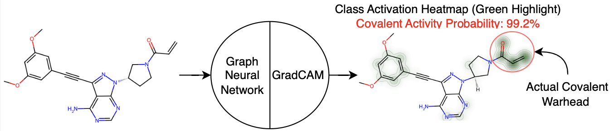

# Link to Paper



# Setup environment and run models

## Running a docker image
We recommend using the scripts by pulling the publicly available docker image:

```
docker pull vcanogil/covalent-classifier:latest
```

## Installing locally
Using the python environment manager of your choice (Python 3.10 is recommended):

```
# Example using conda env manager
conda create -n cov-classifer python=3.10
conda activate cov-classifer
pip install -r requirements.txt
```

## Running the training script
If you want to simply to train a model, run either from the from the **main** directory:
```
python models/graph/train.py
```
or
```
python models/fingerprint/train.py
```
If you want to specify which particular fingerprint model to run, specify that in the script source itself.

# Loading the model and making a prediction
To load one of the graph models from the `saved_models` folder, run the following:
```
python models/graph/make_prediction.py Your_Smiles_Or_InChI_String
```
Note that if you want to make predictions in batch, it is recommended to alter the script as the original function loads the model every time it makes a prediction.

# Generating a GradCAM heatmap
You can generate a class activation heatmap by running the following command from the main directory:
```
python models/graph/gradcam.py Your_Smiles_Or_InChI_String
```
This will make a file named `gradcam_heatmap.png`. If you want to adapt this to your needs, refer to `models/graph/gradcam.py` file itself.

By default, `GCNII` model is used. You can modifiy which model to use to produce the heatmap by modifying the argument in `make_gradcam_heatmap` of `models/graph/gradcam.py` module, or by training your own model.

# Troubleshooting

If trying to load the models for your own work, you may encounter an error:

```
ValueError: No TypeSpec has been registered with name 'molgraph.tensors.graph_tensor.GraphTensorSpec'
```

running `import molgraph` in your current code should remediate that.


# ProteinReactiveDB
Dataset built for this project can be found under `data/InChI_all/training_data_all.csv`.
The `data` folder also includes structures excluded from various public databases used to build ProteinReactiveDB, as well as the test data grouped by type of structure.

# Reference
Cano Gil, V. H.; Rowley, C. <em>ChemRxiv</em> **2023**.  doi: [10.26434/chemrxiv-2023-d0dqp](https://doi.org/10.26434/chemrxiv-2023-d0dqp)
