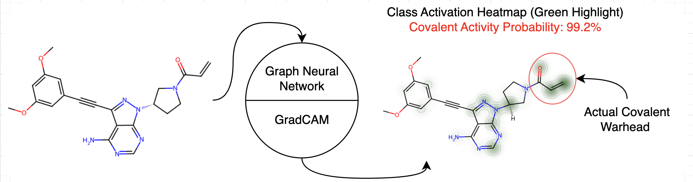

# Link to Paper



# Setup environment and run models
Using the python environment manager of your choice (Python~3.10):

```
$ pip install -r requirements.txt
```
If you want to simply to train a model, run either from the from the main directory:
```
$ python models/graph/train_test.py
```
or
```
$ python models/fingerprint/train_test.py
```
If you want to specify which particular fingerprint model to run, specify that in the script source itself.

# Generating a GradCAM heatmap
You can generate a class activation heatmap by running the following command from the main directory:
```
$ python models/gradcam.py Your_Smiles_Or_InChI_String
```
This will make a file named `gradcam_heatmap.png`. If you want to adapt this to your needs, refer to `models/graph/gradcam.py` file itself.

By default, `GCNII` model is used. You can modifiy which model to use to produce the heatmap by modifying the argument in `make_gradcam_heatmap` of `models/graph/gradcam.py` module, or by training your own model.

# AIMNet data
Non-aiment data is available as InChI strings in the `./data` folder.
AIMNet data is too large to be hosted here, and can be found at this address:

# Reference
